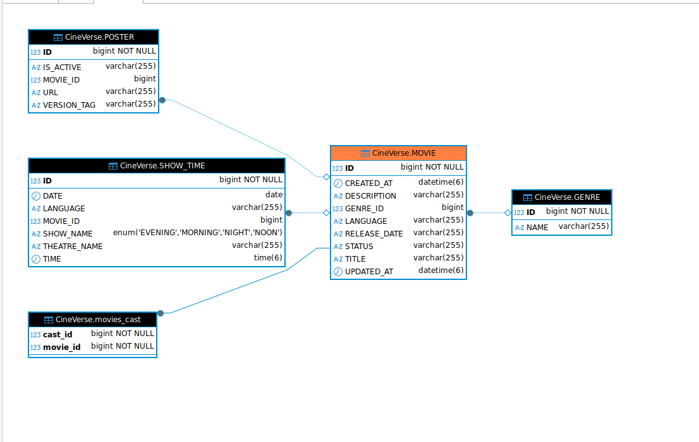

# Cineverse-microservice

-- MOVIE - SERVICE


# Cineverse-microservice


<!-- 
-- USER - SERVICE

1.In this service we create a new user and register with the application .
2.List the total users 
3.change the password  for existing user 
4.delete user 

-- list the user (GET)
API : http://localhost:8765/user/view-user

-- create a new user (POST)
API : http://localhost:8765/user/register
{
"userName": "tom_h",
"email": "tom.hanks@example.com",
"password": "Tom@0001",
"age": 40,
"firstName": "Tom",
"lastName": "Hanks",
"mobileNumber": "+91 9445566778",
"dateOfBirth": "1984-06-01",
"userType": "REGULAR"
}

-- change the password (PUT)
API : http://localhost:8765/user/change-password?oldPassword=Hari@2001&newPassword=Hari@2002&userName=hari

 -->


# 🎬 CineVerse – Smart Movie Ticketing & Recommendation Platform

CineVerse is a **production-ready microservice-based movie ticket booking and review platform** built using **Java, Spring Boot, Kafka, Spring Batch, Spring Security, Docker, and MySQL**. It provides users with a seamless movie booking experience, while offering admins full control over content, analytics, and automated reports.

---

## 🚀 Features

- 🔐 User registration, login/logout, and JWT-based role-based access control (Admin, Manager, User)
- 🎥 Browse now-showing and upcoming movies with showtimes
- 🎫 Book, cancel, and reschedule tickets with seat selection
- 📱 QR code generation for digital ticketing
- ✍️ Add and update movie reviews and ratings
- 🎯 Personalized movie recommendations based on viewing history
- 📢 Real-time Kafka-powered notifications (email/SMS) for bookings and releases
- 📊 Batch-generated daily/weekly reports (Spring Batch)
- 🧪 A/B testing support for movie poster optimization
- 📈 Admin dashboard with detailed analytics on revenue, ratings, and users
- 🐳 Fully containerized with Docker and Docker Compose

---

## 🧱 Microservice Architecture

| Microservice         | Responsibility                                                                 |
|----------------------|---------------------------------------------------------------------------------|
| **Gateway Service**        | Handles routing, JWT validation, and request forwarding                      |
| **User Service**           | User registration, login, profile updates, and role management               |
| **Movie Service**          | CRUD for movies, genres, showtimes, and poster A/B testing                  |
| **Booking Service**        | Seat management, ticket booking/cancelation, and QR code generation         |
| **Review Service**         | Posting and managing movie reviews and ratings                              |
| **Recommendation Service** | Generates personalized recommendations based on user activity               |
| **Batch Report Service**   | Scheduled job to generate and export analytics reports (Spring Batch)       |
| **Notification Service**   | Kafka consumer for sending email/SMS notifications                          |

---

## 🛠️ Technology Stack

| Layer            | Technology                     |
|------------------|-------------------------------|
| Backend          | Java 17, Spring Boot          |
| Security         | Spring Security, JWT          |
| Messaging        | Apache Kafka                  |
| Batch Processing | Spring Batch                  |
| Caching (optional) | Redis                        |
| Database         | MySQL                         |
| API Gateway      | Spring Cloud Gateway          |
| Containerization | Docker, Docker Compose        |

---

## 🔄 Kafka Topics Used

| Topic Name             | Description                                  |
|------------------------|----------------------------------------------|
| `ticket-booked`        | Triggered on successful ticket booking       |
| `review-posted`        | Triggered when a user submits a review       |
| `movie-released`       | Used to notify users about new releases      |
| `recommendation-updated` | Updates personalized suggestions           |

---

## 👤 User Roles

| Role           | Permissions                                                   |
|----------------|---------------------------------------------------------------|
| `ROLE_USER`    | Can browse movies, book tickets, post reviews                 |
| `ROLE_MANAGER` | Manage showtimes, seat layouts, and moderate reviews          |
| `ROLE_ADMIN`   | Full access to CRUD movies, analytics, and report generation  |

---

## ♻️ Redis Caching (Optional)

- Top-rated movies by genre
- Frequently searched movies
- Popular theatres by city

---

## 📊 Admin Dashboard Highlights

- Visual charts for bookings, revenue, and ratings
- Control over movie uploads and A/B poster variants
- Moderate and approve reviews
- Monitor active users and trends

---

## 📁 Reports Generated (via Spring Batch)

- Daily and weekly reports on:
  - Revenue per movie
  - User activity trends
  - Top-rated and most-watched movies

---

## 🧪 A/B Testing for Posters

- Upload multiple poster versions
- Track performance via click-through or booking rate
- Automatically determine most engaging variant

---

## 💡 Recommendation Engine

- Tracks user's genre preferences and review history
- Suggests relevant movies with personalized touch
- Optionally pluggable with ML/AI model (e.g., OpenAI)

---

## 💼 Resume Line (for job seekers)

> Built a scalable microservice-based movie ticketing platform using Java, Spring Boot, Kafka, Spring Security, and Spring Batch. Implemented personalized recommendations, A/B testing for UI engagement, and real-time Kafka-driven notifications. Deployed using Docker in a containerized architecture.

---

## 📦 How to Run the Project

```bash
# Clone the repository
git clone https://github.com/your-username/cineverse-microservice.git
cd cineverse-microservice

# Run all services using Docker Compose
docker-compose up --build

# Access gateway at:
http://localhost:8080


